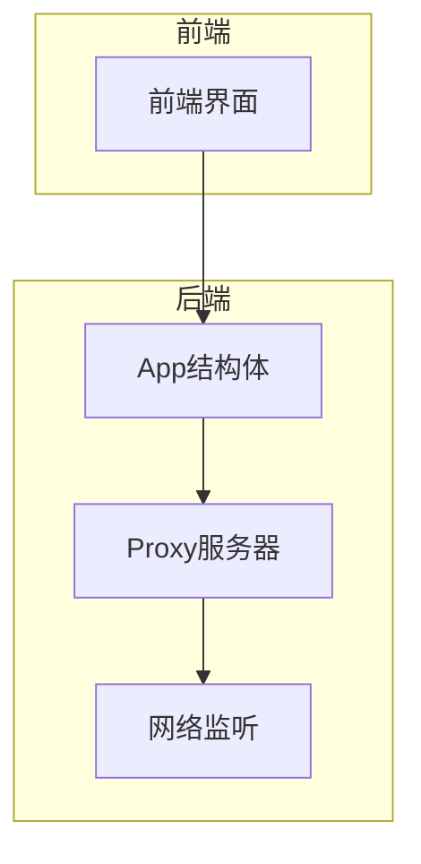

# 局域网监听功能信息架构设计草稿 [已归档]

> **归档说明**：本文件已归档，内容已正式迁移至 [design.md](file:///workspace/docs/spec/design.md)

## 1. 技术架构

### 1.1 系统架构

### 1.2 核心模块

| 模块 | 职责 | 文件路径 |
|------|------|----------|
| App | 应用核心逻辑，管理代理状态和lanMode | app.go |
| Proxy | 代理服务器实现，处理网络请求 | internal/proxy/proxy.go |
| 前端界面 | 用户交互，显示和控制局域网监听功能 | 前端系统配置模块 |

## 2. 数据模型

### 2.1 App结构体

| 字段名 | 类型 | 描述 | 默认值 |
|--------|------|------|--------|
| lanMode | bool | 局域网监听模式状态 | false |
| proxyServer | *ProxyServer | 代理服务器实例 | nil |
| // 其他现有字段 | | | |

### 2.2 方法定义

| 方法名 | 参数 | 返回值 | 描述 |
|--------|------|--------|------|
| SetLanMode | enabled bool | error | 设置局域网监听模式 |
| IsLanMode | 无 | bool | 获取局域网监听模式状态 |
| // 其他现有方法 | | | |

## 3. 接口设计

### 3.1 后端接口

| 方法名 | 参数 | 返回值 | 描述 |
|--------|------|--------|------|
| SetLanMode | enabled bool | error | 设置局域网监听模式 |
| IsLanMode | 无 | bool | 获取局域网监听模式状态 |

### 3.2 前端接口

| 接口路径 | 方法 | 参数 | 返回值 | 描述 |
|----------|------|------|--------|------|
| /api/lan-mode | POST | {"enabled": boolean} | {"success": boolean, "error": string} | 设置局域网监听模式 |
| /api/lan-mode | GET | 无 | {"enabled": boolean} | 获取局域网监听模式状态 |

## 4. 技术实现细节

### 4.1 后端实现

1. **App结构体修改**：
   - 添加`lanMode bool`字段
   - 实现`SetLanMode`和`IsLanMode`方法

2. **Proxy服务器修改**：
   - 添加`LanListenAddr = "0.0.0.0"`常量
   - 修改服务器初始化逻辑，支持动态监听地址

3. **代理状态管理**：
   - 当设置lanMode时，检查当前代理状态
   - 如果代理已运行，自动重启使配置生效

### 4.2 前端实现

1. **界面修改**：
   - 在系统配置模块添加"监听局域网"按钮
   - 按钮状态根据lanMode值显示

2. **交互逻辑**：
   - 点击按钮时切换lanMode状态
   - 调用后端API设置lanMode
   - 处理API调用结果，显示相应提示

### 4.3 数据流

1. **设置lanMode流程**：
   - 前端点击按钮 → 调用SetLanMode API → 后端检查代理状态 → 重启代理（如果需要） → 返回结果 → 前端更新按钮状态

2. **获取lanMode流程**：
   - 前端页面加载 → 调用IsLanMode API → 后端返回lanMode状态 → 前端更新按钮状态

## 5. 配置管理

| 配置项 | 类型 | 默认值 | 描述 |
|--------|------|--------|------|
| lanMode | bool | false | 局域网监听模式状态 |
| listenAddr | string | "127.0.0.1" | 代理服务器监听地址（根据lanMode动态调整） |
| listenPort | int | 443 | 代理服务器监听端口 |

## 6. 错误处理

| 错误类型 | 错误码 | 描述 | 处理方式 |
|----------|--------|------|----------|
| 代理重启失败 | 500 | 停止或启动代理时发生错误 | 返回错误信息，保持原有状态 |
| 参数错误 | 400 | 传入的参数无效 | 返回错误信息，不执行操作 |
| 网络错误 | 503 | 网络连接异常 | 返回错误信息，建议检查网络 |

## 7. 性能考虑

- **内存使用**：添加一个bool字段，内存开销可忽略
- **CPU使用**：代理重启操作仅在状态切换时执行，对CPU影响很小
- **网络影响**：监听0.0.0.0可能会接收到更多网络请求，但影响可控

## 8. 安全考虑

- **默认关闭**：局域网监听功能默认关闭，减少安全风险
- **防火墙**：建议用户在开启时确保防火墙设置正确
- **网络环境**：建议在安全的局域网环境中使用

## 9. 兼容性考虑

- **操作系统**：支持所有主流操作系统（Windows, macOS, Linux）
- **网络环境**：支持各种局域网拓扑结构
- **浏览器**：前端界面兼容主流浏览器

## 10. 未来扩展

- **端口配置**：可考虑允许用户自定义监听端口
- **访问控制**：可考虑添加局域网访问控制机制
- **多网卡支持**：可考虑支持选择特定网卡进行监听